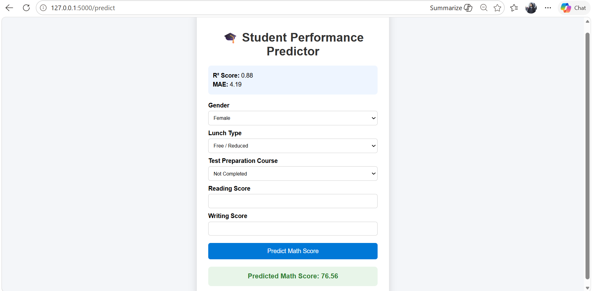

# 🎓 Student Performance Predictor

## Overview

Student Performance Predictor is a Machine Learning web application that predicts a student's math score based on academic and demographic features. The project uses Linear Regression and provides real-time predictions through a Flask-based web interface.

---

## Application Screenshots

### Home Page

### Prediction Result

> Replace the image names above with your actual screenshot filenames if they are different.

---

## Features

- Predicts student math scores using Machine Learning
- Real-time prediction through a web interface
- Data preprocessing and feature encoding
- Linear Regression model training and evaluation
- Flask integration for deployment
- Clean and responsive UI

---

## Technologies Used

### Machine Learning
- Python
- Pandas
- NumPy
- Scikit-Learn

### Web Development
- Flask
- HTML
- CSS

### Tools
- VS Code
- Git
- GitHub

---

## Dataset

The project uses the Student Performance Dataset containing:

- Gender
- Race/Ethnicity
- Parental Level of Education
- Lunch Type
- Test Preparation Course
- Reading Score
- Writing Score
- Math Score

### Target Variable

**Math Score**

---

## Machine Learning Workflow

1.